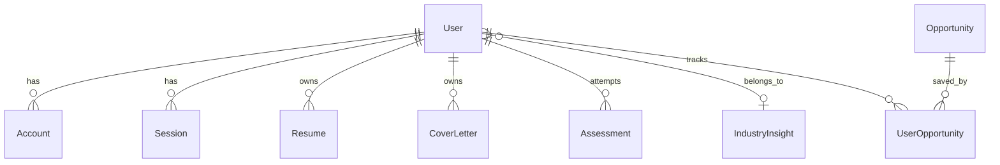
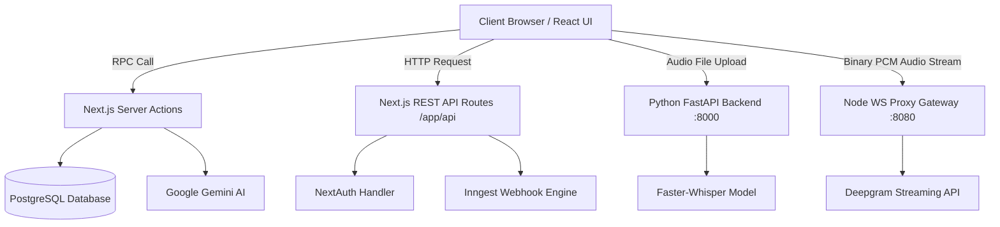

# 🗄️ SkillsCraft Database, API & Middleware Technical Specifications

This specification document provides an exhaustive reference for the **SkillsCraft** backend ecosystem, detailing the **PostgreSQL + Prisma ORM** persistence layer, **Next.js Server Actions (RPC)**, **REST API Routes**, **Microservice APIs** (FastAPI & WebSocket), and **System Middlewares/Interceptors**.

---

## 📑 Table of Contents
1. [📊 Database Architecture & Entity Relationship Diagram](#-database-architecture--entity-relationship-diagram)
2. [🗂️ Database Models & Operations Matrix](#-database-models--operations-matrix)
3. [🔌 API Specifications Breakdown](#-api-specifications-breakdown)
   - [3.1 Next.js Server Actions (RPC APIs)](#31-nextjs-server-actions-rpc-apis)
   - [3.2 REST API Route Handlers (`app/api/`)](#32-rest-api-route-handlers-appapi)
   - [3.3 Microservice APIs](#33-microservice-apis)
4. [🛡️ Middlewares & Interceptors Breakdown](#-middlewares--interceptors-breakdown)
5. [🔒 Security, Constraints & Data Flow Integrity](#-security-constraints--data-flow-integrity)

---

## 📊 Database Architecture & Entity Relationship Diagram

The persistent store is a **PostgreSQL** relational database managed using **Prisma ORM** ([`prisma/schema.prisma`](file:///c:/Users/lenovo/Documents/GitHub/Skills-craft/prisma/schema.prisma)). The system uses PostgreSQL foreign key constraints, unique composite indexes, and cascade delete rules to ensure structural integrity across user profile management, AI resume building, cover letters, mock assessments, market insights, and opportunity tracking.



---

## 🗂️ Database Models & Operations Matrix

Below is the detailed specification of all primary domain models, key fields, database query methods executed via Prisma Client, and relational dependencies:

| Domain Model | Key Fields | Database Operations / Queries | Relational Dependencies |
| :--- | :--- | :--- | :--- |
| **`User`** | `id`, `email`, `password`, `skills`, `experience`, `industry`, `bio`, `industryInsightId` | `findUnique`, `update` (onboarding & profile edits), `create` (auth signup), `include` (relations) | Parent to `Resume`, `CoverLetter`, `Assessment`, `UserOpportunity`. Belongs to `IndustryInsight` (optional). |
| **`Account` / `Session`** | `userId`, `provider`, `providerAccountId`, `sessionToken`, `expires` | OAuth session storage, credential auth, JWT adapter persistence managed by NextAuth | Belongs to `User` with `onDelete: Cascade`. |
| **`Resume`** | `id`, `userId`, `content`, `resumeData` (Json), `atsScore`, `feedback` | `upsert` (create/edit resume), `findUnique` by `userId` | Unique 1:1 relation with `User` (`userId` unique constraint, `onDelete: Cascade`). |
| **`CoverLetter`** | `id`, `userId`, `content`, `jobDescription`, `companyName`, `jobTitle`, `status` | `create` (new letter generation), `findMany` (list user letters), `findUnique`, `delete` | Belongs to `User` (`onDelete: Cascade`). |
| **`Assessment`** | `id`, `userId`, `quizScore`, `questions` (Json[]), `interviewType`, `timeSpent`, `difficulty`, `topicsTested` | `create` (save quiz/interview result), `findMany` (fetch quiz history & performance metrics) | Belongs to `User` (`onDelete: Cascade`). |
| **`IndustryInsight`** | `id`, `industry`, `salaryRanges` (Json[]), `growthRate`, `demandLevel`, `topSkills`, `marketOutlook`, `keyTrends`, `recommendedSkills` | `upsert` (Inngest background cron update), `findUnique` (fetch market stats by industry) | 1:Many relation with `User` (`users User[]`). |
| **`Opportunity`** | `id`, `externalId`, `type`, `title`, `organization`, `platform`, `url`, `isRemote`, `isPaid`, `tags` | `findMany` (filtered paginated search), `upsert` (external scraper / Inngest sync by `externalId`) | 1:Many relation with `UserOpportunity`. |
| **`UserOpportunity`** | `id`, `userId`, `opportunityId`, `status` (SAVED, BOOKMARKED, APPLIED, COMPLETED), `notes` | `upsert` (bookmark/apply tracking), `findMany` (user tracked applications list) | Belongs to `User` and `Opportunity`. Enforces unique composite constraint `@@unique([userId, opportunityId])`. |

---

## 🔌 API Specifications Breakdown

SkillsCraft utilizes a dual-architecture paradigm combining **Next.js Server Actions (RPC)** for direct database/AI invocations and explicit **REST / WebSocket APIs** for auth, webhooks, audio microservices, and live streaming.



---

### 3.1 Next.js Server Actions (RPC APIs)

Server Actions are secure, server-side RPC methods defined in [`actions/`](file:///c:/Users/lenovo/Documents/GitHub/Skills-craft/actions/). They execute directly on the Next.js server with session context validation.

1. **`saveResume(content: string)`** ([`actions/resume.js`](file:///c:/Users/lenovo/Documents/GitHub/Skills-craft/actions/resume.js))
   - **Authentication**: Requires valid NextAuth session.
   - **Operation**: Upserts Markdown resume text and structured form state into the `Resume` table indexed by `userId`.
   - **Returns**: Updated `Resume` database record.

2. **`improveWithAI(data: { currentResume, type })`** ([`actions/resume-intelligence.js`](file:///c:/Users/lenovo/Documents/GitHub/Skills-craft/actions/resume-intelligence.js))
   - **Operation**: Formats resume section content and sends a targeted prompt to the Google Gemini AI engine (`@google/genai`).
   - **Returns**: High-impact, ATS-optimized bullet points and action verbs.

3. **`generateQuiz()`** ([`actions/assessment.js`](file:///c:/Users/lenovo/Documents/GitHub/Skills-craft/actions/assessment.js))
   - **Operation**: Reads the user's saved `industry` and `skills` from Prisma, queries Gemini AI to construct a 10-question technical/behavioral quiz formatted in JSON.
   - **Returns**: Formatted array of quiz questions with multiple-choice options and explanation keys.

4. **`saveAssessmentResult(result: AssessmentPayload)`** ([`actions/assessment.js`](file:///c:/Users/lenovo/Documents/GitHub/Skills-craft/actions/assessment.js))
   - **Operation**: Evaluates selected options against answer keys, computes score percentages, duration, and topic strengths, and saves an `Assessment` database record.
   - **Returns**: Saved assessment ID and feedback summary.

5. **`generateCoverLetter(data: CoverLetterPayload)`** ([`actions/cover-letter.js`](file:///c:/Users/lenovo/Documents/GitHub/Skills-craft/actions/cover-letter.js))
   - **Operation**: Combines user profile details, target company name, and job description text into a Gemini prompt to author a tailored cover letter. Saves output to `CoverLetter` model.
   - **Returns**: Created `CoverLetter` object.

6. **`getOpportunities(filters: OpportunityFilters)`** ([`actions/opportunities.js`](file:///c:/Users/lenovo/Documents/GitHub/Skills-craft/actions/opportunities.js))
   - **Operation**: Queries `Opportunity` records with multi-clause Prisma filtering (type, platform, remote status, search tags) and joins `UserOpportunity` tracking status for the current user.
   - **Returns**: Paginated list of opportunities with tracking badges.

7. **`parseDocumentAction(formData: FormData)`** ([`actions/parse-document.js`](file:///c:/Users/lenovo/Documents/GitHub/Skills-craft/actions/parse-document.js))
   - **Operation**: Receives uploaded PDF/DOCX file stream, validates binary signatures, and routes to document extractors (`pdf-parse` / `mammoth`).
   - **Returns**: Clean raw text string extracted from the document.

---

### 3.2 REST API Route Handlers (`app/api/`)

| Endpoint Route | Method | Description | Primary Location |
| :--- | :--- | :--- | :--- |
| `/api/auth/[...nextauth]` | `GET / POST` | NextAuth authentication handler managing OAuth callbacks (Google, GitHub), Credentials sign-in, and JWT session handling. | [`app/api/auth/[...nextauth]/route.js`](file:///c:/Users/lenovo/Documents/GitHub/Skills-craft/app/api/auth/[...nextauth]/route.js) |
| `/api/inngest` | `GET / POST / PUT` | Inngest webhook endpoint serving background job declarations, scheduled market insight updates, and scrapers. | [`app/api/inngest/route.js`](file:///c:/Users/lenovo/Documents/GitHub/Skills-craft/app/api/inngest/route.js) |
| `/api/industries` | `GET` | Returns available industry categories, sub-industries, and skill mappings for onboarding forms. | [`app/api/industries/route.js`](file:///c:/Users/lenovo/Documents/GitHub/Skills-craft/app/api/industries/route.js) |
| `/api/transcribe` | `POST` | Proxy handler receiving audio blobs from the web app and forwarding them to the Python Whisper FastAPI microservice. | [`app/api/transcribe/route.js`](file:///c:/Users/lenovo/Documents/GitHub/Skills-craft/app/api/transcribe/route.js) |
| `/api/deepgram` | `GET` | Secure handshake endpoint generating temporary API tokens for authenticating client-side WebSocket streams. | [`app/api/deepgram/route.js`](file:///c:/Users/lenovo/Documents/GitHub/Skills-craft/app/api/deepgram/route.js) |
| `/api/seed-insights` | `POST` | Admin trigger endpoint for seeding and updating baseline industry market trends and salary data. | [`app/api/seed-insights/route.js`](file:///c:/Users/lenovo/Documents/GitHub/Skills-craft/app/api/seed-insights/route.js) |

---

### 3.3 Microservice APIs

#### 1. Python FastAPI Speech Engine (`http://localhost:8000`)
Located in [`backend/main.py`](file:///c:/Users/lenovo/Documents/GitHub/Skills-craft/backend/main.py), this microservice provides GPU/CPU-accelerated audio processing using `faster_whisper`.

- `POST /transcribe/`: Accepts audio multipart file upload, processes speech through `WhisperModel`, returns transcribed text JSON.
- `POST /audio/upload`: Saves uploaded user interview recording binary to disk (`backend/uploads/audio/`) with a unique UUID file path.
- `GET /audio/{file_id}`: Static stream server for reviewing saved audio recordings.
- `GET /health`: Healthcheck endpoint reporting Whisper model loaded status, device type (CUDA/CPU), and memory readiness.

#### 2. WebSocket Audio Gateway (`ws://localhost:8080`)
Located in [`server/deepgram-ws.js`](file:///c:/Users/lenovo/Documents/GitHub/Skills-craft/server/deepgram-ws.js), this Node.js service acts as a full-duplex streaming proxy.

- **Protocol**: `ws://` / `wss://`
- **Functionality**: Establishes a client WebSocket, receives raw binary PCM audio chunks recorded via `MediaRecorder`, streams them to `wss://api.deepgram.com`, and broadcasts real-time text transcripts back to the web application.

---

## 🛡️ Middlewares & Interceptors Breakdown

### 1. NextAuth Authentication Middleware
- **Source File**: [`middleware.js`](file:///c:/Users/lenovo/Documents/GitHub/Skills-craft/middleware.js)
- **Mechanism**: Wraps Next.js route matching using `NextAuth(authConfig).auth`.
- **Protected Paths**:
  - `/dashboard/*`
  - `/interview/*`
  - `/onboarding/*`
  - `/ai-cover-letter/*`
- **Behavior**: Evaluates request session headers (`req.auth`). If an unauthenticated user attempts to access protected routes, it immediately performs a zero-leak redirect to `/api/auth/signin`.

```javascript
// Excerpt from middleware.js
export default auth((req) => {
  const isLoggedIn = !!req.auth;
  const { pathname } = req.nextUrl;

  const isProtectedRoute = 
    pathname.startsWith("/dashboard") ||
    pathname.startsWith("/interview") ||
    pathname.startsWith("/onboarding") ||
    pathname.startsWith("/ai-cover-letter");

  if (isProtectedRoute && !isLoggedIn) {
    return Response.redirect(new URL("/api/auth/signin", req.nextUrl));
  }
});
```

---

### 2. FastAPI Cross-Origin Resource Sharing (CORS) Middleware
- **Source File**: [`backend/main.py`](file:///c:/Users/lenovo/Documents/GitHub/Skills-craft/backend/main.py)
- **Mechanism**: Configures `fastapi.middleware.cors.CORSMiddleware`.
- **Allowed Origins**: `http://localhost:3000` (configurable via environment variables).
- **Behavior**: Intercepts preflight HTTP `OPTIONS` requests from the web front-end, validating request origins, headers, and credentials before granting permission for audio transcription uploads.

```python
# Excerpt from backend/main.py
app.add_middleware(
    CORSMiddleware,
    allow_origins=origins,
    allow_credentials=True,
    allow_methods=["*"],
    allow_headers=["*"],
)
```

---

### 3. WebSocket Proxy Audio Bridge Middleware
- **Source File**: [`server/deepgram-ws.js`](file:///c:/Users/lenovo/Documents/GitHub/Skills-craft/server/deepgram-ws.js)
- **Mechanism**: Node.js `ws` server connection handling and socket lifecycle interceptor.
- **Behavior**: Validates client connection requests, manages authentication headers with Deepgram services, forwards binary PCM audio frames, handles disconnect reconnects, and safely serializes JSON transcription frames back to the UI.

---

### 4. File Format Parsing Middleware Engine
- **Source File**: [`actions/parse-document.js`](file:///c:/Users/lenovo/Documents/GitHub/Skills-craft/actions/parse-document.js)
- **Mechanism**: Server-side binary buffer inspector supporting PDF and DOCX mime-types.
- **Behavior**: Inspects uploaded file byte headers, routes PDF documents to `pdf-parse`/`pdf2json`, and routes Microsoft Word (`.docx`) files through `mammoth.extractRawText`, serializing clean unformatted text output for AI resume analysis.

```javascript
// Excerpt from actions/parse-document.js
if (file.type === "application/pdf") {
  const data = await pdfParse(buffer);
  return data.text;
} else if (file.type === "application/vnd.openxmlformats-officedocument.wordprocessingml.document") {
  const result = await mammoth.extractRawText({ buffer });
  return result.value;
}
```

---

## 🔒 Security, Constraints & Data Flow Integrity

1. **Cascade Deletes**: Deleting a `User` cascades down to delete dependent `Account`, `Session`, `Resume`, `CoverLetter`, `Assessment`, and `UserOpportunity` records, preventing orphaned database rows.
2. **Unique Composite Constraints**: Enforces single bookmark/application records per user/opportunity pair via `@@unique([userId, opportunityId])` in `UserOpportunity`.
3. **Session Verification**: Server Actions perform server-side authentication checks using NextAuth (`auth()`) prior to carrying out database read/write actions or issuing Gemini AI credits.
