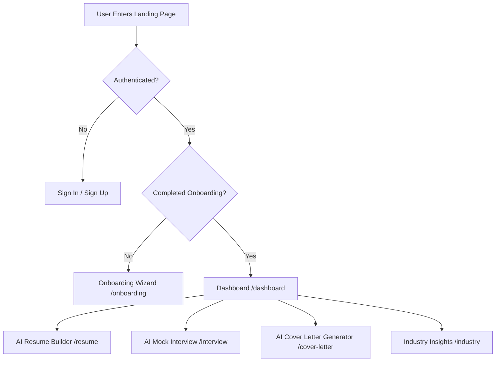

# 🎨 SkillsCraft Frontend Implementation & Setup Guide

Welcome to the **SkillsCraft Frontend Documentation**. SkillsCraft is an AI-powered career coaching application built with Next.js 16 (App Router), React 19, and Tailwind CSS v4.

---

## 📐 Architecture & Technology Stack

| Layer | Technology | Purpose |
| :--- | :--- | :--- |
| **Framework** | Next.js 16.1.3 (App Router) | Server-side rendering, routing, & static generation |
| **UI Library** | React 19.2.3 | Component rendering & state management |
| **Styling** | Tailwind CSS v4 | Utility-first responsive styling & CSS variables |
| **UI Components** | Shadcn UI (Radix Primitives) | Accessible, customizable UI components |
| **Form Handling** | React Hook Form & Zod | Form management & schema validation |
| **Data Visualization**| Recharts | Interactive charts for interview performance analytics |
| **Document Export** | `html2pdf.js` & `@uiw/react-md-editor` | Markdown preview and PDF generation for resumes |
| **Animations** | Framer Motion | Smooth UI transitions & micro-interactions |
| **Icons & Loader** | Lucide React & Nextjs Toploader | Modern icon set & top progress bar |

---

## 📁 Frontend Directory Structure

```
├── app/
│   ├── (auth)/             # Authentication routes (Sign-in / Sign-up)
│   │   ├── sign-in/
│   │   └── sign-up/
│   ├── (main)/             # Protected application layout & pages
│   │   ├── account/        # User profile & account management
│   │   ├── cover-letter/   # AI Cover Letter generator & list
│   │   ├── dashboard/      # Main dashboard (Industry Insights & Overview)
│   │   ├── industry/       # Industry trends detail page
│   │   ├── interview/      # AI Mock Interview system & results
│   │   ├── resume/         # AI Resume builder & preview
│   │   └── layout.js       # Shared sidebar/header layout for authenticated routes
│   ├── onboarding/         # Guided user onboarding flow (skills, bio, industry)
│   ├── api/                # Client-to-Server API routes
│   ├── globals.css         # Tailwind CSS v4 styles & custom utilities
│   ├── layout.js           # Root layout with ThemeProvider, TopLoader & Toaster
│   └── page.jsx            # Landing page (Hero, Features, Testimonials, FAQ)
├── components/             # Reusable UI & Page components
│   ├── ui/                 # Shadcn primitives (button, card, dialog, tabs, etc.)
│   ├── header.jsx          # Top navigation bar
│   ├── hero.jsx            # Dynamic landing page hero component
│   ├── theme-provider.jsx  # Dark/light mode theme context wrapper
│   └── resume-builder.jsx  # Multi-step resume creation wizard
├── hooks/                  # Custom React hooks (e.g., useFetch for Server Actions)
├── data/                   # Static landing page content & features list
└── public/                 # Static assets (logos, icons, images)
```

---

## 🖥️ Core Frontend Features & Implementations



### 1. 🚀 Landing Page (`app/page.jsx`)
- **Hero Section**: High-impact messaging with gradient typography and animated CTAs (`components/hero.jsx`).
- **Feature Showcase**: Grid layout displaying key tools (Resume Improvement, Mock Interviews, Market Insights).
- **Interactive FAQ & Testimonials**: Accordion UI using Shadcn components (`components/ui/accordion.jsx`).

### 2. 📝 AI Resume Builder & PDF Exporter (`app/(main)/resume/`)
- **Markdown Editor**: Integrated `@uiw/react-md-editor` for real-time resume editing.
- **AI Improvement Trigger**: Button connecting to Gemini AI Server Action (`actions/resume.js`) for bullet point enhancement.
- **PDF Generation**: Client-side conversion of live Markdown HTML to PDF using `html2pdf.js`.

### 3. 🎤 Mock Interview System (`app/(main)/interview/`)
- **Quiz Generator**: Dynamic quiz based on chosen industry & difficulty level.
- **Interactive Quiz Interface**: Step-by-step questions with selection radios and submission triggers.
- **Performance Analytics**: Visual score graphs powered by **Recharts** showing quiz results and progress over time.

### 4. ✉️ AI Cover Letter Generator (`app/(main)/cover-letter/`)
- **Form Submission**: Form collecting job title, company name, and job description.
- **Markdown Preview & Management**: Save, view, and export customized cover letters.

---

## ⚡ Setup & Execution Guide

### Prerequisites
- **Node.js**: v18.17.0 or higher (v20.x recommended)
- **Package Manager**: `npm` (v9+) or `yarn` / `pnpm` / `bun`

### 1. Install Dependencies
Run the following command in the project root:
```bash
npm install
```

### 2. Configure Environment Variables
Create or verify your `.env` file in the root directory:
```env
NEXT_PUBLIC_CLERK_PUBLISHABLE_KEY=pk_test_...
CLERK_SECRET_KEY=sk_test_...
AUTH_SECRET=your_auth_secret_key
AUTH_URL=http://localhost:3000
NEXT_PUBLIC_APP_URL=http://localhost:3000
```

### 3. Run the Development Server
Execute the Next.js dev command:
```bash
npm run dev
```

Open your browser and navigate to:
👉 **[http://localhost:3000](http://localhost:3000)**

### 4. Build for Production
To test production build locally:
```bash
npm run build
npm run start
```

---

## 🎨 Theme & Component Guidelines
- **Tailwind CSS v4**: Theme colors and variables are configured inside `app/globals.css`.
- **Shadcn UI Components**: Located under `components/ui/`. To add new components:
  ```bash
  npx shadcn@latest add <component-name>
  ```
- **Dark/Light Mode**: Toggle handled by `next-themes` via `components/theme-provider.jsx`.
