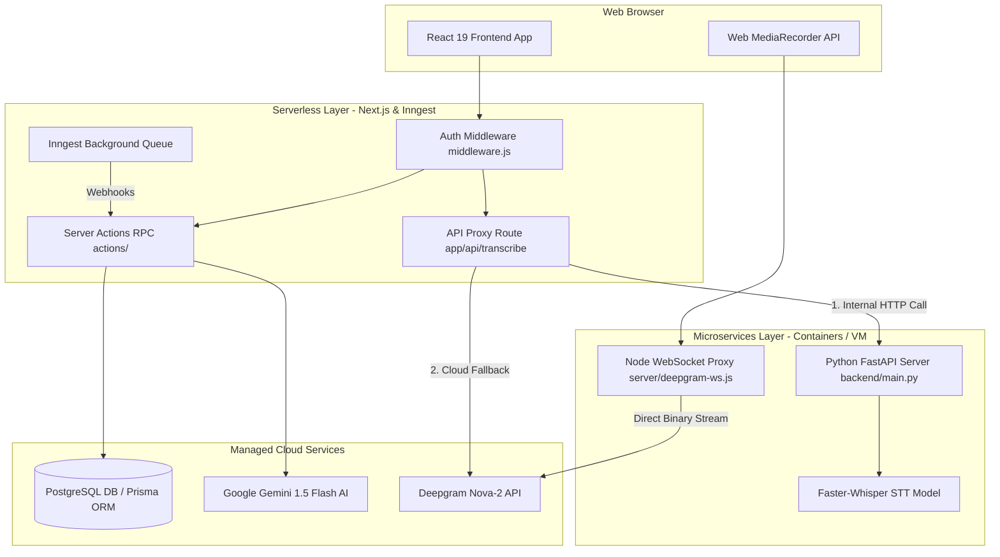

# 🚀 Developer Guide: Hybrid Microservices & Serverless Architecture in SkillsCraft

Welcome to the **SkillsCraft** engineering team! This guide will explain how our **Hybrid Microservices & Serverless Architecture** is designed, implemented, and executed in our codebase.

---

## 📌 1. High-Level Architecture Overview

SkillsCraft uses a **Hybrid Model** to get the best of both worlds:
- **Serverless Tier (Next.js App Router + Vercel + Inngest)**: Handles 90% of requests (UI rendering, user authentication, AI prompt orchestration, DB operations, background cron jobs). It scales automatically to zero when inactive and incurs zero idle server costs.
- **Dedicated Microservices Tier (Python FastAPI + Node WebSocket Proxy)**: Handles stateful, compute-intensive, or streaming workloads (GPU/CPU-heavy Whisper Speech-to-Text inference, binary audio storage, and low-latency WebSocket streaming).



---

## 🛠️ 2. Detailed Breakdown & Code Implementations

---

### Layer A: Serverless Execution (Next.js Server Actions)

Server Actions act as stateless serverless functions. They run securely on the server without creating traditional REST endpoint boilerplate.

#### 📄 Example Code: Server Action for AI & DB Operations
From [`actions/assessment.js`](file:///c:/Users/lenovo/Documents/GitHub/Skills-craft/actions/assessment.js):

```javascript
"use server";

import { auth } from "@/auth";
import { db } from "@/lib/prisma";
import { GoogleGenerativeAI } from "@google/generative-ai";

const genAI = new GoogleGenerativeAI(process.env.GEMINI_API_KEY);

/**
 * Serverless Action: Generates customized technical quiz questions
 */
export async function generateQuiz() {
  // 1. Authenticate stateless request
  const session = await auth();
  if (!session?.user?.id) throw new Error("Unauthorized");

  // 2. Fetch User metadata from PostgreSQL via Prisma
  const user = await db.user.findUnique({
    where: { id: session.user.id },
    select: { industry: true, skills: true },
  });

  // 3. Call Google Gemini Serverless AI API
  const model = genAI.getGenerativeModel({ model: "gemini-1.5-flash" });
  const prompt = `Generate 10 technical quiz questions for a candidate in ${user.industry} with skills: ${user.skills.join(", ")}. Return JSON format.`;
  
  const result = await model.generateContent(prompt);
  const quizData = JSON.parse(result.response.text());

  return quizData;
}
```

> **Why Serverless?**  
> `generateQuiz()` runs statelessly. When a user requests a quiz, a serverless lambda function spins up, executes the Gemini API request + Prisma query, returns data to the client, and immediately terminates.

---

### Layer B: Microservice Integration Bridge (API Proxy Route)

To keep frontend code clean and avoid exposing internal microservice URLs directly to the client browser, Next.js serverless routes act as an **internal proxy bridge** with automatic cloud fallback mechanisms.

#### 📄 Example Code: Serverless-to-Microservice Bridge
From [`app/api/transcribe/route.js`](file:///c:/Users/lenovo/Documents/GitHub/Skills-craft/app/api/transcribe/route.js):

```javascript
import { NextResponse } from "next/server";

export async function POST(request) {
  try {
    const formData = await request.formData();
    const audioFile = formData.get("audio");
    const FASTAPI_URL = process.env.NEXT_PUBLIC_STT_API_URL || "http://localhost:8000";

    // ── STEP 1: Attempt to invoke local Python FastAPI Microservice ─────────
    try {
      const form = new FormData();
      form.append("audio", audioFile, audioFile.name || "recording.webm");

      const res = await fetch(`${FASTAPI_URL}/api/transcribe`, {
        method: "POST",
        body: form,
        signal: AbortSignal.timeout(4000), // 4-second timeout for local service
      });

      if (res.ok) {
        const data = await res.json();
        return NextResponse.json({ transcript: data.transcript, source: "FastAPI-Whisper" });
      }
    } catch (err) {
      console.warn("[Bridge] FastAPI microservice unavailable, switching to Cloud fallback...");
    }

    // ── STEP 2: Fallback to Managed Deepgram Cloud API ───────────────────────
    if (process.env.DEEPGRAM_API_KEY) {
      // Fallback transcription logic via Cloud SaaS...
    }
  } catch (err) {
    return NextResponse.json({ error: err.message }, { status: 500 });
  }
}
```

---

### Layer C: Dedicated Python Microservice (Faster-Whisper STT Engine)

A dedicated Python service is required because local AI models (like Faster-Whisper `medium`) require continuous CPU/GPU memory allocation and FFmpeg bindings which cannot run in Vercel serverless lambdas.

#### 📄 Example Code: FastAPI Microservice Server
From [`backend/main.py`](file:///c:/Users/lenovo/Documents/GitHub/Skills-craft/backend/main.py):

```python
from fastapi import FastAPI, UploadFile, File, HTTPException
from fastapi.middleware.cors import CORSMiddleware
from faster_whisper import WhisperModel
import time

app = FastAPI(title="SkillsCraft STT Microservice")

# Enable CORS for local Next.js origin
app.add_middleware(
    CORSMiddleware,
    allow_origins=["http://localhost:3000"],
    allow_methods=["*"],
    allow_headers=["*"],
)

# Model Singleton: Loaded ONCE in memory when the server boots
MODEL = None

def get_whisper_model():
    global MODEL
    if MODEL is None:
        print("⏳ Loading Faster-Whisper model 'medium' into memory...")
        MODEL = WhisperModel("medium", device="cpu", compute_type="int8")
    return MODEL

@app.post("/api/transcribe")
async def transcribe_audio(audio: UploadFile = File(...)):
    model = get_whisper_model()
    
    # Save temporary audio file
    temp_path = f"uploads/{audio.filename}"
    with open(temp_path, "wb") as f:
        f.write(await audio.read())
        
    # Execute Whisper inference model
    segments, info = model.transcribe(temp_path, beam_size=5)
    transcript_text = " ".join([seg.text for seg in segments])
    
    return {
        "transcript": transcript_text,
        "language": info.language,
        "duration_seconds": info.duration
    }
```

---

### Layer D: Node.js WebSocket Proxy Microservice (Real-time Audio Streaming)

Serverless environments do not support long-lived bidirectional WebSocket connections. We run a dedicated Node.js WebSocket proxy on port `8080` to bridge live audio streaming from the user's browser to Deepgram.

#### 📄 Example Code: Real-time Audio Stream Proxy
From [`server/deepgram-ws.js`](file:///c:/Users/lenovo/Documents/GitHub/Skills-craft/server/deepgram-ws.js):

```javascript
const { WebSocketServer, WebSocket } = require("ws");

// Start persistent WebSocket server on port 8080
const wss = new WebSocketServer({ port: 8080 });

wss.on("connection", (clientSocket) => {
  console.log("🎙️ Client connected for real-time speech interview");

  // Open upstream persistent socket connection to Deepgram SaaS
  const deepgramSocket = new WebSocket("wss://api.deepgram.com/v1/listen?model=nova-2", {
    headers: { Authorization: `Token ${process.env.DEEPGRAM_API_KEY}` }
  });

  // Relay client binary audio chunks directly to Deepgram
  clientSocket.on("message", (chunk) => {
    if (deepgramSocket.readyState === WebSocket.OPEN) {
      deepgramSocket.send(chunk);
    }
  });

  // Forward Deepgram transcript text back to client browser
  deepgramSocket.on("message", (data) => {
    clientSocket.send(data);
  });
});
```

---

### Layer E: Asynchronous Background Serverless Processing (Inngest)

Standard serverless HTTP functions terminate after sending responses. To handle long-running background tasks (e.g., cron jobs updating industry insights every 24 hours), we use **Inngest**.

#### 📄 Example Code: Inngest Event Queue Worker
From [`lib/inngest/client.js`](file:///c:/Users/lenovo/Documents/GitHub/Skills-craft/lib/inngest/client.js) & background function:

```javascript
import { Inngest } from "inngest";
import { db } from "@/lib/prisma";

export const inngest = new Inngest({ id: "skills-craft" });

// Background Cron Worker: Executes every Sunday at midnight
export const syncIndustryInsights = inngest.createFunction(
  { id: "sync-industry-insights" },
  { cron: "0 0 * * 0" }, // Weekly trigger schedule
  async ({ step }) => {
    const industries = ["Software Engineering", "Data Science", "AI/ML"];

    for (const industry of industries) {
      await step.run(`fetch-data-${industry}`, async () => {
        // Query market trend APIs and update PostgreSQL via Prisma
        await db.industryInsight.upsert({
          where: { industry },
          update: { lastUpdated: new Date() },
          create: { industry, topSkills: ["React", "Python", "Next.js"] },
        });
      });
    }
  }
);
```

---

## 📊 Summary Comparison: Serverless vs. Microservices

| Design Property | Serverless Layer (Next.js / Inngest) | Microservice Layer (FastAPI / WS Proxy) |
| :--- | :--- | :--- |
| **Deployment Model** | Auto-scaling functions (Vercel / Edge) | Persistent container / process (`node`, `uvicorn`) |
| **Lifecycle** | Ephemeral (spins up per request, scales to zero) | Stateful / Long-running background daemon |
| **Primary Tasks** | UI rendering, Server Actions, AI prompts, DB CRUD | GPU/CPU audio processing, WebSocket binary streams |
| **Scaling** | Unlimited horizontal scaling automatically | Container instance scaling (Docker / Kubernetes) |
| **State Management** | Externalized to Neon PostgreSQL (Prisma) | In-memory model singleton + file uploads directory |

---

## 🎯 Key Takeaways for New Developers

1. **Adding standard features?** Create a Server Action in `actions/` or a Next.js route component. Keep it stateless and query the database via `lib/prisma.js`.
2. **Adding heavy ML processing or file conversion?** Place the logic inside `backend/main.py` in Python, or create a route handler in FastAPI.
3. **Adding real-time streaming sockets?** Build or modify handlers in `server/deepgram-ws.js`.
4. **Adding background scheduled jobs?** Register a function with `inngest.createFunction()` under `lib/inngest/`.
