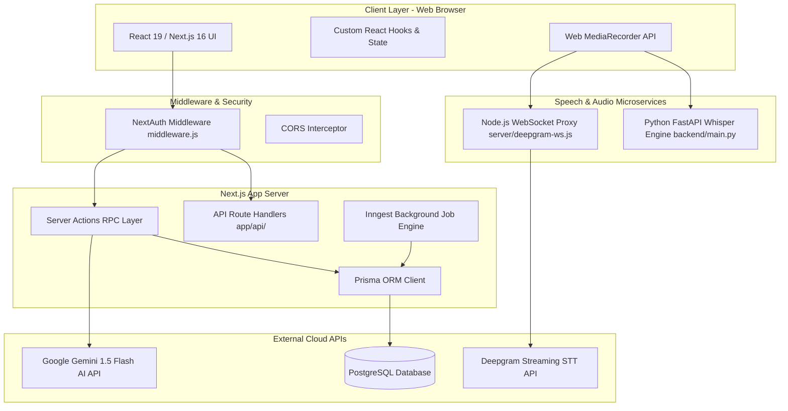
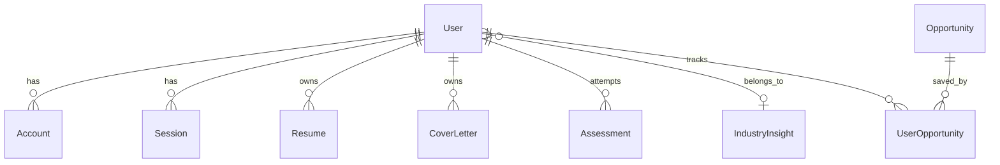
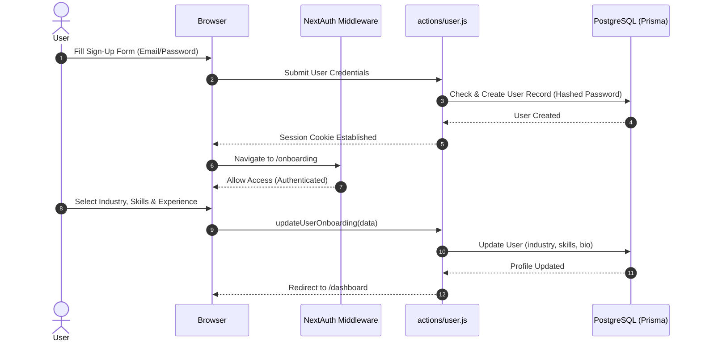
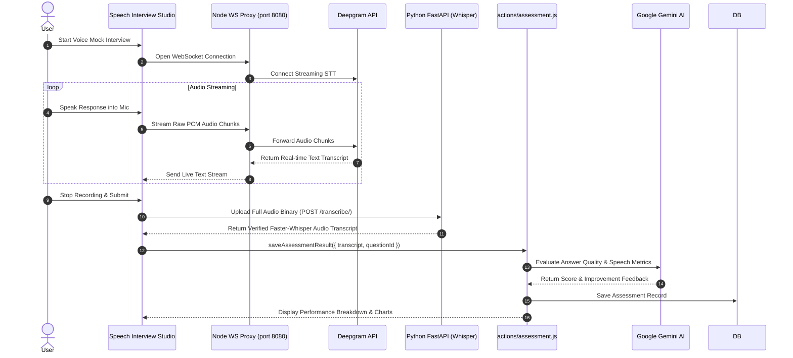

# 🧩 SkillsCraft Architectural Component Breakdown

This document provides a comprehensive, fine-grained breakdown of the **SkillsCraft** ecosystem into modular components across **Frontend**, **Backend**, **Database Operations**, **APIs**, **Middlewares**, **System Architecture**, and **Execution Flows**.

---

## 📑 Table of Contents
1. [🏗️ System Architecture & Component Topology](#️-system-architecture--component-topology)
2. [🎨 Frontend Components Breakdown](#-frontend-components-breakdown)
3. [⚙️ Backend Components Breakdown](#️-backend-components-breakdown)
4. [🗄️ Database Operations & Schema Breakdown](#️-database-operations--schema-breakdown)
5. [🔌 API Specifications Breakdown](#-api-specifications-breakdown)
6. [🛡️ Middlewares & Interceptors Breakdown](#️-middlewares--interceptors-breakdown)
7. [🔄 End-to-End System Flows Breakdown](#-end-to-end-system-flows-breakdown)

---

## 🏗️ System Architecture & Component Topology

SkillsCraft follows a **Hybrid Microservices & Serverless Architecture**, combining Next.js App Router for full-stack SSR/RPC, a Python FastAPI microservice for local GPU/CPU speech recognition, Node WS proxy for real-time audio streaming, and PostgreSQL with Prisma for state management.



---

## 🎨 Frontend Components Breakdown

The frontend is built with **Next.js 16 (App Router)**, **React 19**, **Tailwind CSS v4**, **Shadcn UI (Radix Primitives)**, and **Framer Motion**.

### 1. Root Layout & Core Provider Components
| Component Unit | Path | Responsibilities & Description |
| :--- | :--- | :--- |
| **Root Layout** | [`app/layout.js`](file:///c:/Users/lenovo/Documents/GitHub/Skills-craft/app/layout.js) | Global HTML wrapper, injects fonts, `ThemeProvider`, `NextTopLoader`, and `Toaster` notifications. |
| **Theme Provider** | [`components/theme-provider.jsx`](file:///c:/Users/lenovo/Documents/GitHub/Skills-craft/components/theme-provider.jsx) | Context wrapper for NextThemes enabling light/dark mode toggling. |
| **Session Provider** | [`components/session-provider.jsx`](file:///c:/Users/lenovo/Documents/GitHub/Skills-craft/components/session-provider.jsx) | Wraps application with `SessionProvider` for NextAuth authentication state access. |
| **Header Navigation** | [`components/header.jsx`](file:///c:/Users/lenovo/Documents/GitHub/Skills-craft/components/header.jsx) | Sticky header with responsive navigation menu, brand logo, action buttons, and active route state. |
| **Footer Component** | [`components/footer.jsx`](file:///c:/Users/lenovo/Documents/GitHub/Skills-craft/components/footer.jsx) | Global footer containing page links, social icons, copyright details, and legal disclaimers. |
| **User Profile Button** | [`components/user-button.jsx`](file:///c:/Users/lenovo/Documents/GitHub/Skills-craft/components/user-button.jsx) | Dropdown menu rendering avatar, user name, profile shortcut, and sign-out trigger. |

### 2. Feature & Application Page Components
| Component Unit | Path | Responsibilities & Description |
| :--- | :--- | :--- |
| **Landing Hero** | [`components/hero.jsx`](file:///c:/Users/lenovo/Documents/GitHub/Skills-craft/components/hero.jsx) | Interactive landing banner featuring dynamic typography, CTAs, and background glow animations. |
| **Features Grid** | [`components/features.jsx`](file:///c:/Users/lenovo/Documents/GitHub/Skills-craft/components/features.jsx) | Grid highlighting AI career tools (Resume Builder, Mock Interviews, Opportunity Tracker). |
| **Dashboard Layout & View** | [`app/(main)/dashboard/page.jsx`](file:///c:/Users/lenovo/Documents/GitHub/Skills-craft/app/\(main\)/dashboard/page.jsx) | Authenticated home hub displaying user metrics, industry overview, and quick action cards. |
| **Resume Builder Engine** | [`components/dashboard/resume-builder.jsx`](file:///c:/Users/lenovo/Documents/GitHub/Skills-craft/components/dashboard/resume-builder.jsx) | Multi-tab form builder for experience, education, skills, and real-time Markdown preview. |
| **Resume AI Enhancer** | [`components/resume/resume-intelligence.jsx`](file:///c:/Users/lenovo/Documents/GitHub/Skills-craft/components/resume/resume-intelligence.jsx) | Triggers AI ATS score calculation, bullet point rewriting, and resume parse validation. |
| **Interview Assessment Quiz** | [`components/interview/quiz.jsx`](file:///c:/Users/lenovo/Documents/GitHub/Skills-craft/components/interview/quiz.jsx) | Dynamic quiz UI with question navigation, timer countdown, radio option selection, and score submit. |
| **Speech Interview Studio** | [`components/interview/interview-preview.jsx`](file:///c:/Users/lenovo/Documents/GitHub/Skills-craft/components/interview/interview-preview.jsx) | Audio recording component supporting live speech-to-text, wave animation, and voice interview. |
| **Cover Letter Generator** | [`app/(main)/cover-letter/new/page.jsx`](file:///c:/Users/lenovo/Documents/GitHub/Skills-craft/app/\(main\)/cover-letter/new/page.jsx) | Form collecting job details, generating AI cover letter drafts, and managing saved letters. |
| **Industry Insights View** | [`components/industry/dashboard-view.jsx`](file:///c:/Users/lenovo/Documents/GitHub/Skills-craft/components/industry/dashboard-view.jsx) | Data visualization charts showing salary ranges, demand levels, and trending tech skills. |
| **Opportunity Finder Grid** | [`app/(main)/opportunities/page.jsx`](file:///c:/Users/lenovo/Documents/GitHub/Skills-craft/app/\(main\)/opportunities/page.jsx) | Filterable card grid for jobs, internships, hackathons, and open source programs with search. |
| **Onboarding Wizard** | [`app/onboarding/page.jsx`](file:///c:/Users/lenovo/Documents/GitHub/Skills-craft/app/onboarding/page.jsx) | Guided multi-step onboarding wizard collecting user bio, experience level, industry, and skills. |

### 3. UI Base Components & Primitives (`components/ui/`)
- **Button / Input / Select**: Shadcn standard form controls based on `@radix-ui/react-select` and `slot`.
- **Card / Accordion / Dialog / Tabs**: Structural layout containers using `@radix-ui` primitives.
- **Progress Bar / Badge / Avatar**: Micro visual status indicators for scores and metrics.
- **Markdown Editor**: Integrated `@uiw/react-md-editor` for rich text resume editing.

### 4. Custom React Hooks
- **`useFetch(cb)`** ([`hooks/use-fetch.js`](file:///c:/Users/lenovo/Documents/GitHub/Skills-craft/hooks/use-fetch.js)): Wrapper hook for Server Actions handling loading, data, and error state transitions.
- **`useSpeechRecognition()`**: Custom hook interfacing with Web Speech API and WebSocket audio streams.

---

## ⚙️ Backend Components Breakdown

The backend ecosystem comprises **Server Actions**, **API Routes**, **Inngest Workers**, a **Python FastAPI Microservice**, and a **Node.js WebSocket Proxy**.

```
Backend Component Stack
├── Server Actions (RPC Execution) ────► Next.js Server Environment
├── Inngest Cron & Queue Engine ───────► Background Workers & External Scraping
├── Python FastAPI Microservice ────────► Faster-Whisper CPU/GPU STT Model
├── Node.js WebSocket Bridge Proxy ────► Deepgram Real-time Audio Stream
└── Document Ingestion Middleware ─────► Mammoth, PDF2JSON & PDF-Parse
```

### 1. Server Actions Components (`actions/`)
| Action Unit | Path | Functional Responsibility |
| :--- | :--- | :--- |
| **User Profile Action** | [`actions/user.js`](file:///c:/Users/lenovo/Documents/GitHub/Skills-craft/actions/user.js) | Updates user profile, onboarding state, industry selection, and skills vector. |
| **Resume Core Action** | [`actions/resume.js`](file:///c:/Users/lenovo/Documents/GitHub/Skills-craft/actions/resume.js) | Save/fetch resume content, trigger AI bullet point optimization via Gemini. |
| **Resume Intelligence** | [`actions/resume-intelligence.js`](file:///c:/Users/lenovo/Documents/GitHub/Skills-craft/actions/resume-intelligence.js) | Calculates ATS match scores, extracts keywords, identifies formatting flaws. |
| **Assessment & Quiz Action** | [`actions/assessment.js`](file:///c:/Users/lenovo/Documents/GitHub/Skills-craft/actions/assessment.js) | Generates industry-tailored technical quizzes, grades answers, saves assessment history. |
| **Cover Letter Action** | [`actions/cover-letter.js`](file:///c:/Users/lenovo/Documents/GitHub/Skills-craft/actions/cover-letter.js) | Generates personalized AI cover letters from user resume and job postings. |
| **Opportunities Core** | [`actions/opportunities.js`](file:///c:/Users/lenovo/Documents/GitHub/Skills-craft/actions/opportunities.js) | Queries opportunity database with dynamic filters, handles user bookmark/save status. |
| **Opportunities Sync** | [`actions/opportunities-sync.js`](file:///c:/Users/lenovo/Documents/GitHub/Skills-craft/actions/opportunities-sync.js) | Syncs live external opportunities (LeetCode, RemoteOK, Devpost) into local database. |
| **Industry Insights** | [`actions/industry.ts`](file:///c:/Users/lenovo/Documents/GitHub/Skills-craft/actions/industry.ts) | Fetches market statistics, top skills, salary distributions by industry sector. |
| **Document Parser** | [`actions/parse-document.js`](file:///c:/Users/lenovo/Documents/GitHub/Skills-craft/actions/parse-document.js) | Extracts raw text from uploaded PDF and DOCX files for resume pre-filling. |

### 2. AI Prompt Engine & Client (`lib/ai/`)
- **Gemini Client Initialization**: Configured `@google/generative-ai` with system instructions and JSON mode output schema constraints.
- **Prompt Builders**: Structured prompts for generating ATS scores, cover letter paragraphs, and quiz question sets.

### 3. Background Job & Ingest Processor (`lib/inngest/`)
- **`inngest/client.js`**: Inngest client configuration with application event definitions.
- **`functions/generate-industry-insights.js`**: Cron worker executing periodically to pull market trends, update salary brackets, and populate `IndustryInsight` records.

### 4. Audio & Speech Services
- **Python FastAPI Faster-Whisper Microservice** ([`backend/main.py`](file:///c:/Users/lenovo/Documents/GitHub/Skills-craft/backend/main.py)):
  - Loads Whisper `medium` model into memory (CPU/CUDA).
  - Receives uploaded audio files (`.wav`, `.mp3`, `.m4a`, `.webm`).
  - Executes FFmpeg audio normalization and returns transcribed text with time-stamped segments.
- **Node.js Deepgram WebSocket Proxy** ([`server/deepgram-ws.js`](file:///c:/Users/lenovo/Documents/GitHub/Skills-craft/server/deepgram-ws.js)):
  - Opens WebSocket server on port `8080`.
  - Establishes persistent connection to Deepgram's streaming STT API.
  - Relays audio chunks bidirectionally between browser speech clients and Deepgram.

---

## 🗄️ Database Operations & Schema Breakdown

The persistent store is a **PostgreSQL** database managed using **Prisma ORM (`prisma/schema.prisma`)**.



### Database Models & Operations Matrix

| Domain Model | Key Fields | Database Operations / Queries | Relational Dependencies |
| :--- | :--- | :--- | :--- |
| **`User`** | `id`, `email`, `password`, `skills`, `experience`, `industry` | `findUnique`, `update` (onboarding), `create` (signup), `include` relations | Parent to `Resume`, `CoverLetter`, `Assessment`, `UserOpportunity` |
| **`Account` / `Session`** | `userId`, `provider`, `sessionToken`, `expires` | OAuth session storage, JWT adapter persistence managed by NextAuth | Belongs to `User` (cascade delete) |
| **`Resume`** | `id`, `userId`, `content`, `resumeData`, `atsScore`, `feedback` | `upsert` (create/edit resume), `findUnique` by `userId` | Unique 1:1 relation with `User` |
| **`CoverLetter`** | `id`, `userId`, `content`, `jobDescription`, `companyName` | `create` (new letter), `findMany` (list user letters), `delete` | Belongs to `User` |
| **`Assessment`** | `id`, `userId`, `quizScore`, `questions`, `interviewType`, `timeSpent` | `create` (save test attempt), `findMany` (fetch score history & metrics) | Belongs to `User` |
| **`IndustryInsight`** | `id`, `industry`, `salaryRanges`, `growthRate`, `topSkills`, `marketOutlook` | `upsert` (Inngest cron update), `findUnique` (fetch industry stats) | 1:Many relation with `User` |
| **`Opportunity`** | `id`, `externalId`, `type`, `title`, `organization`, `platform`, `url` | `findMany` (filtered search), `upsert` (external scraper sync) | 1:Many relation with `UserOpportunity` |
| **`UserOpportunity`** | `id`, `userId`, `opportunityId`, `status`, `notes` | `upsert` (bookmark/apply), `findMany` (user tracked applications) | Unique composite constraint `[userId, opportunityId]` |

---

## 🔌 API Specifications Breakdown

SkillsCraft utilizes both **Next.js Server Actions (RPC)** and explicit **REST / WebSocket APIs**.

### 1. Next.js Server Actions (RPC APIs)
- **`saveResume(content: string)`**: Validates user auth session and upserts Markdown resume into `Resume` model.
- **`improveWithAI(data: { currentResume, type })`**: Sends resume snippet to Gemini AI, returns enhanced bullet point string.
- **`generateQuiz()`**: Fetches user's industry & skills, queries Gemini AI to construct 10 technical quiz questions.
- **`saveAssessmentResult(result: AssessmentPayload)`**: Evaluates user answers, computes score percentage, saves `Assessment` record.
- **`generateCoverLetter(data: CoverLetterPayload)`**: Passes job context to Gemini AI and creates a new `CoverLetter` entry.
- **`getOpportunities(filters: OpportunityFilters)`**: Queries `Opportunity` table with pagination, search tags, and user saved status.
- **`parseDocumentAction(formData: FormData)`**: Processes uploaded file stream via `mammoth`/`pdf-parse` and returns extracted text.

### 2. REST API Route Handlers (`app/api/`)
| Endpoint Route | Method | Description |
| :--- | :--- | :--- |
| `/api/auth/[...nextauth]` | `GET / POST` | Handles OAuth login callbacks, Credentials authorization, and session token generation. |
| `/api/inngest` | `GET / POST` | Inngest webhook endpoint for background job registration and event execution. |
| `/api/industries` | `GET` | Returns list of available industry options for onboarding select menus. |
| `/api/transcribe` | `POST` | Proxy route forwarding uploaded audio to local Python Whisper microservice. |
| `/api/deepgram` | `GET` | Handshake route returning temporary tokens for Deepgram WebSocket connections. |
| `/api/seed-insights` | `POST` | Admin trigger endpoint for seeding initial industry market data. |

### 3. Microservice APIs
- **Python FastAPI (`http://localhost:8000`)**:
  - `POST /transcribe/`: Accepts audio file upload, processes through `faster_whisper.WhisperModel`, returns text JSON.
  - `POST /audio/upload`: Stores recording binary into `backend/uploads/audio/` with UUID filename.
  - `GET /audio/{file_id}`: Static stream server serving saved audio recordings.
  - `GET /health`: Healthcheck endpoint reporting model status and GPU/CPU resource readiness.
- **WebSocket Gateway (`ws://localhost:8080`)**:
  - Full-duplex WebSocket endpoint accepting binary PCM audio streams and outputting real-time STT transcripts from Deepgram.

---

## 🛡️ Middlewares & Interceptors Breakdown

### 1. NextAuth Authentication Middleware
- **Path**: [`middleware.js`](file:///c:/Users/lenovo/Documents/GitHub/Skills-craft/middleware.js)
- **Mechanism**: Intercepts requests using `NextAuth(authConfig).auth`.
- **Protected Routes**:
  - `/dashboard/*`
  - `/interview/*`
  - `/onboarding/*`
  - `/ai-cover-letter/*`
- **Behavior**: Verifies session token presence (`req.auth`). If unauthenticated on a protected path, performs a zero-leak redirect to `/api/auth/signin`.

### 2. FastAPI Cross-Origin Resource Sharing (CORS) Middleware
- **Path**: [`backend/main.py`](file:///c:/Users/lenovo/Documents/GitHub/Skills-craft/backend/main.py)
- **Mechanism**: Configures `fastapi.middleware.cors.CORSMiddleware`.
- **Allowed Origins**: `http://localhost:3000` (configurable via `CORS_ORIGINS` env var).
- **Behavior**: Intercepts browser preflight requests (`OPTIONS`) to permit cross-origin audio uploads and transcription requests from the Next.js web application.

### 3. WebSocket Proxy Audio Bridge Middleware
- **Path**: [`server/deepgram-ws.js`](file:///c:/Users/lenovo/Documents/GitHub/Skills-craft/server/deepgram-ws.js)
- **Mechanism**: Custom Node.js `ws` server connection handling.
- **Behavior**: Validates client WebSocket upgrade requests, opens an authenticated upstream socket to `wss://api.deepgram.com`, streams raw audio chunks, and formats response frames.

### 4. File Format Parsing Middleware Engine
- **Path**: [`actions/parse-document.js`](file:///c:/Users/lenovo/Documents/GitHub/Skills-craft/actions/parse-document.js)
- **Mechanism**: Dynamic buffer inspector supporting PDF and DOCX mime-types.
- **Behavior**: Routes PDF files through `pdf-parse` / `pdf2json` and DOCX binaries through `mammoth.extractRawText`, serializing unformatted text output to AI consumers.

---

## 🔄 End-to-End System Flows Breakdown

### Flow 1: User Registration & Onboarding Sequence


### Flow 2: Real-time Voice Mock Interview & Analytics Flow


---

## 📌 Summary Matrix

| System Layer | Primary Components | Key Tech Stack | Output Artifacts |
| :--- | :--- | :--- | :--- |
| **Frontend** | 20+ React components, 4 feature modules, 1 multi-step wizard | Next.js 16, React 19, Tailwind CSS v4, Radix UI | Responsive Web App |
| **Backend** | 14 Server Actions, 9 API Routes, 2 Microservices | Node.js, Python FastAPI, Inngest, Gemini API | Server Serverless RPC & REST endpoints |
| **Database** | 8 Data Models, PostgreSQL ORM mapping | Prisma 7.2.0, PostgreSQL | Relational Schema & Typed Queries |
| **Middlewares** | Auth Router, CORS Proxy, File Extractors, WS Bridge | NextAuth v5, WS, Mammoth, PDF-Parse | Secure & Transformed Payload Stream |

